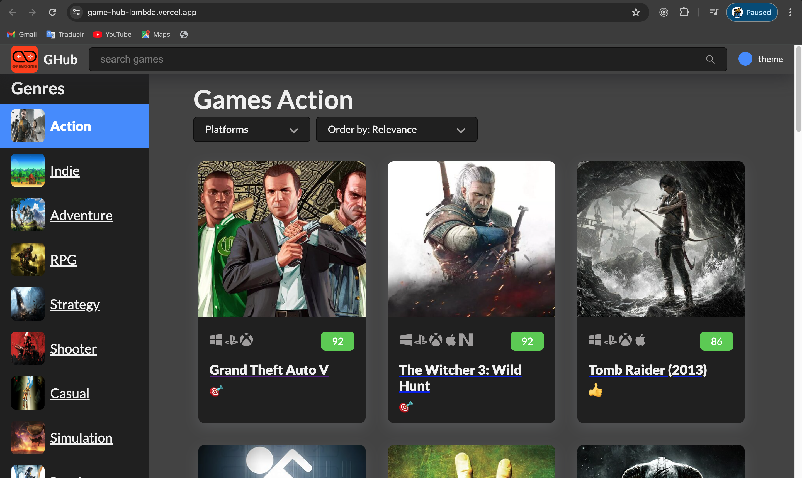

## 🧐 Game-Hub

> This is a page made with React and Typescript, which consumes a videogame API and it has really cool querying and filtering functionality.

## 🔧 Built With

- HTML
- CSS (flexbox and grid)
- TypeScript
- Using mediaqueris for Responsive Design
- React
- hooks
- Zustand
- react-query
- react-loading-skeleton

## 🔴 Live Demo

[Live Demo](https://game-hub-lamda-exj0hy44y-unicorndad8s-projects.vercel.app/)

## 🛠 Getting Started

To get a local copy up and running follow these simple example steps.

- Go to the main page of te repo.
- Press the `Code` button and get the repo link.
- Clone it using git.

## ✒️ Authors

👤 **Unicorn Dad**

- [@UnicornDad8](https://github.com/UnicornDad8)

## 🤝 Contributing

Contributions, issues and feature requests are welcome!

Feel free to check the [issues page](https://github.com/UnicornDad8/game-hub/issues).

## 📝 License

This project is [MIT](lic.url) licensed.
